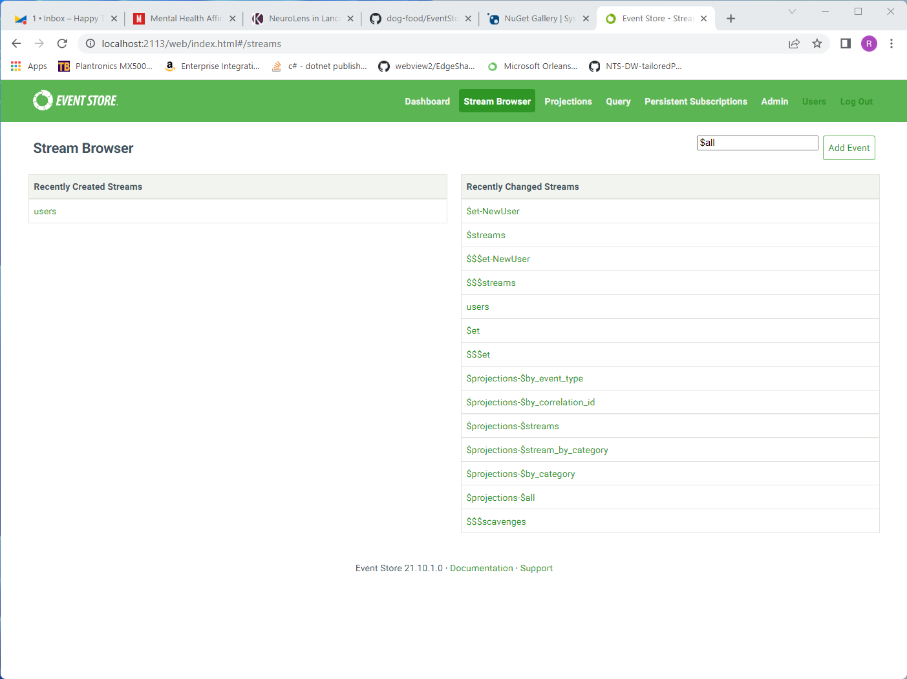
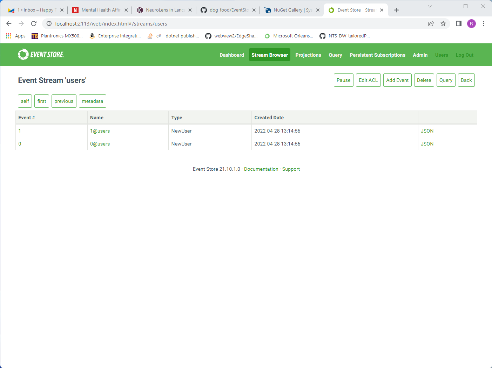
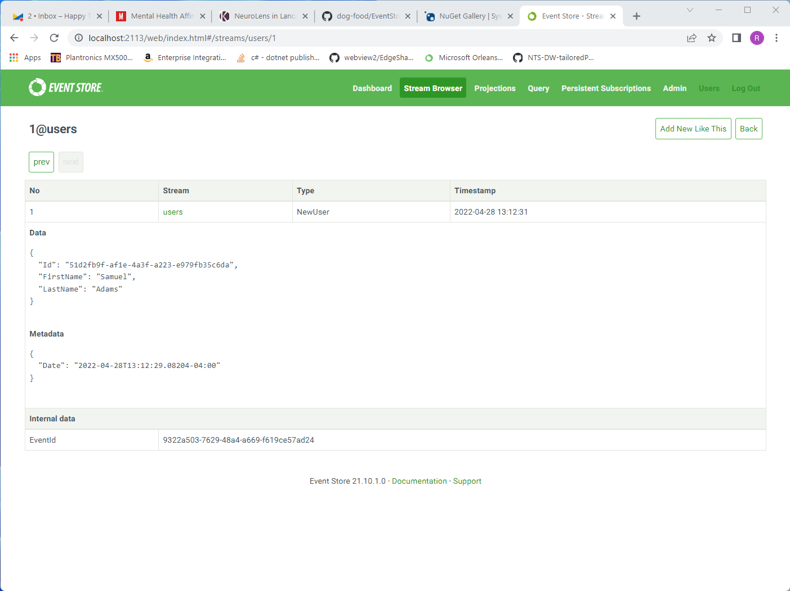

# Introduction #

Welcome to EventStore DB.

This outlines the very basics you need in order to start from nothing to bring an instance of EventStore DB online and using it to move messages through the database.  This QuickStart is geared toward software developers that have knowledge of dotnet core, but have never used EventStore DB before.

# Prerequisites #

* [dotnet core v6 SDK](https://dotnet.microsoft.com/en-us/download/dotnet/6.0)
* [Visual Studio Code](https://code.visualstudio.com/download)

For our purpose within this tutorial, we are using dotnet 6 sdk v6.0.202 and Visual Studio Code: Version: 1.66.2 (system setup) @ commit: dfd34e8260c270da74b5c2d86d61aee4b6d56977

EventStore DB will be running from `C:\ESDB`

# Download #

EventStore DB can be downloaded from [https://www.eventstore.com/downloads](https://www.eventstore.com/downloads).  You will want to choose the latest version.  For this tutorial, we will be using v21.10.2 LTS and will be working on a Windows 11 PC.

> _Note:_ Earlier versions of Windows may be used as well, but the procedures may need to be changed slightly to use this tutorial.

Once downloaded, go to your `Downloads` folder (or where-ever your downloads are saved) and look for the *.zip file you have just downloaded.  Right-click and choose `Extract All` from the context menu, choosing `C:\ESDB\`.

# Launch EventStore DB For the First Time #

> _NOTE:_ The steps below will provide you with the minimum setup you will need for a development environment.  This is not intended to be guidance for setup in a production environment.

With EventStore DB now available on your workstation, open a PowerShell prompt and change your directory:

```PowerShell
cd c:\ESDB
```

Once in the directory, execute the following command to bring a single node instance of EventStore DB online:

```PowerShell
.\EventStore.ClusterNode.exe --insecure=true --RunProjections=All --memdb=true --start-standard-projections=true --enableatompuboverhttp=true
```

To ensure this is now online, open a web browser and navigate to [http://localhost:2113/](http://localhost:2113/)  If this is successful, you should see a web page that looks similar to this:


# Example Use-Cases #

## Reading and Writing Streams ##

Our basic use-case is to write information to a stream, then subsequently read that stream to use the information at a later date.  We'll start by creating a basic solution to work within.  Go ahead and create a working folder to store this solution in, then from within that working folder, execute the following script:

```PowerShell
dotnet new sln; `
`
mkdir StreamWriter; `
dotnet new console -o ./StreamWriter; `
dotnet add ./StreamWriter/StreamWriter.csproj package EventStore.Client.Grpc.Streams --version 22.0.0; `
dotnet add ./StreamWriter/StreamWriter.csproj package System.Text.Json --version 6.0.3; `
dotnet sln add ./StreamWriter; `
`
mkdir StreamReader; `
dotnet new console -o ./StreamReader; `
dotnet add ./StreamReader/StreamReader.csproj package EventStore.Client.Grpc.Streams --version 22.0.0; `
dotnet add ./StreamReader/StreamReader.csproj package System.Text.Json --version 6.0.3; `
dotnet sln add ./StreamReader; `
```

What we've done here is to create two console applications, added them into the solution, then added two supporting libraries into each project:

<dl>
<dt>EventStore.Client.Grpc.Streams</dt>
<dd>This library is the official C# client library for interacting with EventStore DB.  Its basic use-case is for reading, writing, and subscribing to streams.  In later tutorials, we'll look at using other libraries for administration of EventStore DB, etc.</dd>
<dt>System.Text.Json</dt>
<dd>System.Text.Json is being utilized for CLR object serialization and de-serialization where necessary.  Other Json serialization libraries, such as NewtonSoft.Json and SimpleJSON may be used as well.</dd>
</dl>

In each project, there will be a single file that we'll be working in, which is `Program.cs`.

>_Note:_ EventStore DB stores all events as a byte array, allowing for any form of data to be stored.  We highly recommend using Json formatted data to provide an ability to use a few of the more advanced features EventStore DB provides.

### Writing Events To a Stream ###

Open the `Program.cs` file in your `StreamWriter` project.  Replace the contents with the following code snippet:

```CSharp
using System.Text.Json;

using EventStore.Client;

// data elements of two events to be stored within EventStore DB
var events = new[]{
    new {
        Type = "NewUser",
        Metadata = new{
            Date = DateTime.Now
        },
        Body = new {
            Id = Guid.NewGuid(),
            FirstName = "George",
            LastName = "Washington"
        }
    },
    new {
        Type = "NewUser",
        Metadata = new{
            Date = DateTime.Now
        },
        Body = new {
            Id = Guid.NewGuid(),
            FirstName = "Samuel",
            LastName = "Adams"
        }
    }
};

// basic connection to EventStore DB
var settings = EventStoreClientSettings.Create("esdb://localhost:2113?tls=false");
settings.DefaultCredentials = new UserCredentials("admin", "changeit");
var client = new EventStoreClient(settings);
Console.WriteLine("EventStore DB Connection setup.");

// Serialization of the above data.
var serialized = events.Select(e => new EventData(Uuid.NewUuid(), e.Type, JsonSerializer.SerializeToUtf8Bytes(e.Body), JsonSerializer.SerializeToUtf8Bytes(e.Metadata))).ToArray();
Console.WriteLine("Events are serialized and ready for storage.");

// storing the serialized events within EventStore DB
await client.AppendToStreamAsync(
    streamName: "users", 
    expectedRevision: StreamRevision.None, 
    eventData: serialized);
Console.WriteLine("Events have been stored.");
```

Go ahead and save `Program.cs`, then, from the command line, execute the following:

```PowerShell
dotnet run --project .\StreamWriter\StreamWriter.csproj
```

This executes the application and writes your first two events to EventStore DB.  You can validate this by opening your web browser and navigate to [http://localhost:2113/](http://localhost:2113/).  This site is the console UI of EventStore DB.  On the top navigation, go ahead and click the `Stream Browser` link.  You should see a screen similar to:



The left-hand column of the screen shows the list of recently created streams.  If you compare the entry of `users` with the `streamName` value on line 43, you will see that they are the same.  Go ahead and click on the `users` stream link.



In this screen, you will be able to review each of the two events that you have created within the `StreamWriter` console application.  Now, let's talk through the basic information of this screen:

* The Event # column identifies within a stream which event is being addressed.  This is typically a sequential value.  When you do subsequent reads (later in this document), you can provide this number as a starting event to read from.
* The Name of the event, typically noted as `[EventNumber]@[EventStreamName]` is [TBD].
* The `Type` is the type of event.  In the simple code we used to create these event entries, you'll note the type to be the same.  This is useful for better understanding of what the data means at a business level, and how best to decode and interpret the data in relation to your business rules.

Click on the `1@users` link.  You should see a new screen similar to the following:



This is now the details of the second event you wrote in the console application.  Note both the `Metadata` and `Data` values are equivalent to the Metadata and Data values in code.

### Reading Written Events From a Stream ###

Cool!  You've written your first two events into EventStore DB.  Quite easy, is it not?  Now, for EventStore DB to be completely useful, you need to have access to this data in the future.  In other data storage software, we `SELECT` or `Query` this data into a series of records, then map it into our CLR objects.  With EventStore DB, you read the stream data and de-serialize it to CLR objects using a JsonSerializer.

Open the `Program.cs` file in the `StreamReader` project.  Paste the following code into the file, replacing everything else:

> _Note:_ We are not going to deserialize the event data into a CLR object.  Object serialization and de-serialization procedures can be learned through your serialization library of choice.

```CSharp
// basic connection to EventStore DB
using System.Text;

using EventStore.Client;

var settings = EventStoreClientSettings.Create("esdb://localhost:2113?tls=false");
settings.DefaultCredentials = new UserCredentials("admin", "changeit");
var client = new EventStoreClient(settings);
Console.WriteLine("EventStore DB Connection setup.");

var reader = client.ReadStreamAsync(
    direction: Direction.Forwards,
    streamName: "users",
    StreamPosition.Start
);

await foreach(var e in reader) {
    var metadata = Encoding.UTF8.GetString(e.Event.Metadata.ToArray());
    var data = Encoding.UTF8.GetString(e.Event.Data.ToArray());

    Console.WriteLine($"Event Position: {e.OriginalEventNumber}");
    Console.WriteLine($"Event Metadata: {metadata}");
    Console.WriteLine($"Event Data: {data}\n");
}

Console.WriteLine("Read completed.");
```

Save the file, then execute it with the following command:

```PowerShell
dotnet run --project .\StreamReader\StreamReader.csproj
```

With the application completed, you should have output similar to:

```
PS C:\> dotnet run --project .\StreamReader\StreamReader.csproj
EventStore DB Connection setup.
Event Position: 0
Event Metadata: {"Date":"2022-04-28T13:14:53.8737529-04:00"}
Event Data: {"Id":"bd6656fa-525a-475c-b400-a1e4c6e06478","FirstName":"George","LastName":"Washington"}

Event Position: 1
Event Metadata: {"Date":"2022-04-28T13:14:53.8800612-04:00"}
Event Data: {"Id":"1e92905b-f019-4791-98a8-9561ee88a03f","FirstName":"Samuel","LastName":"Adams"}

Read completed.
```

If you compare this output with the EventStore DB Console screen for each event, you will see the values are the same.

## Subscribing to Streams ##

### Why Subscribing to Streams Matters ###

Let's take a moment before we continue to talk about the best way to use a streaming database.  

In other forms of software programming, whether using a document database, a key/value store, or RDBMS, the typical workflow is `INSERT` one or more records into the store, then `SELECT` or `Query` that information to extract it for display onscreen, then finally `DELETE` the information from the data store when it is no longer needed.  

With stream databases, all new information is appended within the database, much like you would write a new entry into your general ledger or checkbook.  Also, you're not needing to perform `SELECT` or `QUERY` operations in most circumstances.  With stream-based programming, using one or more subscriptions to one or many streams will provide an ability to receive notifications when new information is appended to each observed stream as it occurs.  

> Note: If you've worked with UI-based frameworks such as AngularJS, DurandalJS, Caliburn.Micro, React-UI, etc., then this concept should be familar to you already.

Why is this important?  In other methods of writing software, if you want to see updates as users interact with your product, you have to constantly query your data source regularly to retrieve the changes as they occur.  This does indeed work, but as the adoption of the software increases, the server infrastructure must be grown by adding additional instances of your data source software to handle the additional load.

The typical reaction is "Ok, let's add caching into our software!  We'll continue by invalidating the cache each time a change is made, and on the next read, re-build the information for use!"

>The subsequent action looks like:
>
> * Select a caching solution (Redis, Couchbase, etc.)
> * Write a wrapper between our data storage and retrieval logic to check our data cache first.  If we have something in cache, return the cache'd data instead of our read from the database.
> * Adjust our insert, update, and delete events to invalidate the cache.
> * Re-test all scenarios to ensure the cache is updated for each operation within the system.
> * Deploy our caching solution into our environment.
> * Publish our application.

As our solution continues to gain adoption and has to scale, we then have to:

* Add additional instances of the chosen data storage software into its cluster, which will handle the additional demand for queries.
* Add additional instances of the chosen caching server to its cluster, which handles the additional caching demands.
* Run regression testing to ensure our caching solution does not fault under our new minimum load.

What just happened?  We've introduced additional software into our infrastructure, added additional code into our application, and taken on additional third-party libraries to interact with the caching solution.  Also too, we have to do a complete regression of our application to ensure we have not broken anything as part of our enhancements to allow scaling.  This can be quite costly as each update will require a full regression, and we have to maintain additional code to support the caching layer.

With stream-based databases, we can scale without additional code.  Think about it for a moment. The only time you need to change what a user sees on-screen is when new information is introduced within EventStore DB.  By subscribing to the streams, your application is now notified when that information has changed, and you can handle those notifications to change your in-memory models of the streams.  After the updates complete, those changes can be pushed to your UI via webSockets (in the case of web-based applications) or raising `INotifyPropertyChanged` within desktop client applications.

Let's complete the final project(s) in this tutorial to tie everything together.

### Creating the Project ###

To see how subscriptions work within EventStore DB, we're going to create a new solution.  Start by creating a new working folder, then from within that folder, execute the following script:

```PowerShell
dotnet new sln; `
`
mkdir StreamWriter; `
dotnet new console -o ./StreamWriter; `
dotnet add ./StreamWriter/StreamWriter.csproj package EventStore.Client.Grpc.Streams --version 22.0.0; `
dotnet add ./StreamWriter/StreamWriter.csproj package System.Text.Json --version 6.0.3; `
dotnet sln add ./StreamWriter; `
`
mkdir AllStreamListener; `
dotnet new console -o ./AllStreamListener; `
dotnet add ./AllStreamListener/AllStreamListener.csproj package EventStore.Client.Grpc.Streams --version 22.0.0; `
dotnet add ./AllStreamListener/AllStreamListener.csproj package System.Text.Json --version 6.0.3; `
dotnet sln add ./AllStreamListener; `
`
mkdir StreamListener; `
dotnet new console -o ./StreamListener; `
dotnet add ./StreamListener/StreamListener.csproj package EventStore.Client.Grpc.Streams --version 22.0.0; `
dotnet add ./StreamListener/StreamListener.csproj package System.Text.Json --version 6.0.3; `
dotnet sln add ./StreamListener
```

The same as above, you'll notice our use of `EventStore.Client.Grpc.Streams` and `System.Text.Json` for communications with EventStore DB and data serialization/de-serialization.

#### Writing to Streams ####

The following code looks a bit daunting at first.  This code simply creates new events and appends them to one of two streams with a delay of 250ms between writes.  This will allow you to observe the outcome of each subscription.

Open up the `Program.cs` file in your `StreamWriter` project and paste the following code:

```CSharp
using System.Text.Json;

using EventStore.Client;

// data elements of two events to be stored within EventStore DB
var events = new[]{
    new {
        Type = "NewUser",
        Metadata = new{
            Date = DateTime.Now
        },
        Body = new {
            Id = Guid.NewGuid(),
            FirstName = "Samuel",
            LastName = "Adams"
        }
    }
};

// basic connection to EventStore DB
var settings = EventStoreClientSettings.Create("esdb://localhost:2113?tls=false");
settings.DefaultCredentials = new UserCredentials("admin", "changeit");
var client = new EventStoreClient(settings);
Console.WriteLine("EventStore DB Connection setup.");

// Serialization of the above data.
var serialized = events.Select(e => new EventData(Uuid.NewUuid(), e.Type, JsonSerializer.SerializeToUtf8Bytes(e.Body), JsonSerializer.SerializeToUtf8Bytes(e.Metadata))).ToArray();
Console.WriteLine("Events are serialized and ready for storage.");

int index = 0;

do {
    // adds a NewUser event to the users stream
    var user = new {
        Type = "NewUser",
        Metadata = new{
            Date = DateTime.Now
        },
        Body = new {
            Id = Guid.NewGuid(),
            FirstName = $"First Name #{index}",
            LastName = $"Washington {index}"
        }
    };

    var userEventData = new EventData(Uuid.NewUuid(), user.Type, JsonSerializer.SerializeToUtf8Bytes(user.Body), JsonSerializer.SerializeToUtf8Bytes(user.Metadata));

    await client.AppendToStreamAsync(
        streamName: "users",
        expectedState: StreamState.Any,
        eventData: new[] { userEventData });
    Console.WriteLine("New User added.");


    // adds a ClockedIn event into the timeclock stream.
    var timeClock = new {
        Type = "ClockedIn",
        Metadata = new {
            Date = DateTime.Now
        },
        Body = new {
            Id = Guid.NewGuid(),
            UserId = user.Body.Id,
            TimeIn = DateTime.Now
        }
    };

    var timeClockEventData = new EventData(Uuid.NewUuid(), timeClock.Type, JsonSerializer.SerializeToUtf8Bytes(timeClock.Body), JsonSerializer.SerializeToUtf8Bytes(timeClock.Metadata));

    await client.AppendToStreamAsync(
        streamName: "timeclock",
        expectedState: StreamState.Any,
        new[] { timeClockEventData }
    );
    Console.WriteLine("User just clocked-in.");

    await Task.Delay(250);
} while(true);
```

#### Listening to the Users Stream ####

The first subscriber will only listen to the `users` stream.

Open the `Program.cs` file in the `StreamReader` application, then replace the content of that file with the following code:

```CSharp
// basic connection to EventStore DB
using System.Text;

using EventStore.Client;

var settings = EventStoreClientSettings.Create("esdb://localhost:2113?tls=false");
settings.DefaultCredentials = new UserCredentials("admin", "changeit");
var client = new EventStoreClient(settings);
Console.WriteLine("EventStore DB Connection setup.");

var listener = client.SubscribeToStreamAsync(
    streamName: "users",
    start: FromStream.Start,
    eventAppeared: (subscription, e, token) => {
        var metadata = Encoding.UTF8.GetString(e.Event.Metadata.ToArray());
        var data = Encoding.UTF8.GetString(e.Event.Data.ToArray());

        Console.WriteLine($"Event Position: {e.OriginalEventNumber}");
        Console.WriteLine($"Event Metadata: {metadata}");
        Console.WriteLine($"Event Data: {data}\n");
        
        return Task.CompletedTask;
    }
);

using(var subscription = await listener) {
    Console.ReadLine();
}
```

#### Listening to the $all Stream ####

Listening to the `$all` stream can be very powerful in certain use-cases.  The discussion and full use-case is quite in-depth and better covered on its own.  This is a quick demonstration to show that it is possible to listen for all events within EventStore DB.

Open `Program.cs` within your `AllStreamListener` project and replace the contents with the following code snippet:

```CSharp
// basic connection to EventStore DB
using System.Text;

using EventStore.Client;

var settings = EventStoreClientSettings.Create("esdb://localhost:2113?tls=false");
settings.DefaultCredentials = new UserCredentials("admin", "changeit");
var client = new EventStoreClient(settings);
Console.WriteLine("EventStore DB Connection setup.");

var listener = client.SubscribeToAllAsync(
    start: FromAll.Start,
    eventAppeared: (subscription, e, token) => {
        var metadata = Encoding.UTF8.GetString(e.Event.Metadata.ToArray());
        var data = Encoding.UTF8.GetString(e.Event.Data.ToArray());

        Console.WriteLine($"Event Position: {e.OriginalEventNumber}");
        Console.WriteLine($"Event Metadata: {metadata}");
        Console.WriteLine($"Event Data: {data}\n");

        return Task.CompletedTask;
    }
);

using(var subscription = await listener) {
    Console.ReadLine();
}
```


### Run the Solution ###

With the changes made to each of the projects within the solution, let's run them.  To do this, we will open three console windows and execute one project per window.  This provides an ability to observe what each project is doing, in real-time.

Execute the following commands, one in each console window you've opened:

```PowerShell
dotnet run --project .\StreamListener\StreamListener.csproj
```

```PowerShell
dotnet run --project .\AllStreamListener\AllStreamListener.csproj
```

```PowerShell
dotnet run --project .\StreamWriter\StreamWriter.csproj
```

As you observe the output within each console, you'll notice the following:

* Every 250ms, a `NewUser` event is appended to the `users` stream; and a new `ClockedIn` event is appended to the `timeclock` stream.
* In the `AllStreamListener` project, both the `NewUser` and `ClockedIn` events are observed, along with system events that are triggered as part of appending each event into their streams.
* In the `StreamListener` project, only the `NewUser` event is observed, as we are only observing the `users` stream.

# Next Steps #

[How to finish?]

_notes_: I feel like there needs to be a few call to action items from this point:

* Review the rest of EventStore DB's [documentation](https://developers.eventstore.com/server/v21.10/#getting-started)
* Review the documentation for the [gRPC client](https://developers.eventstore.com/clients/grpc/#connection-details) _note_: we need to somehow express here that there are clients available for other languages.
* Learn more about ES/CQRS from "the professionals"
* Look at one or more ES toolkits that are available:
  * [Reactive-Domain](https://github.com/ReactiveDomain/reactive-domain)
  * [Eventuous](https://eventuous.dev/)
  * others?
