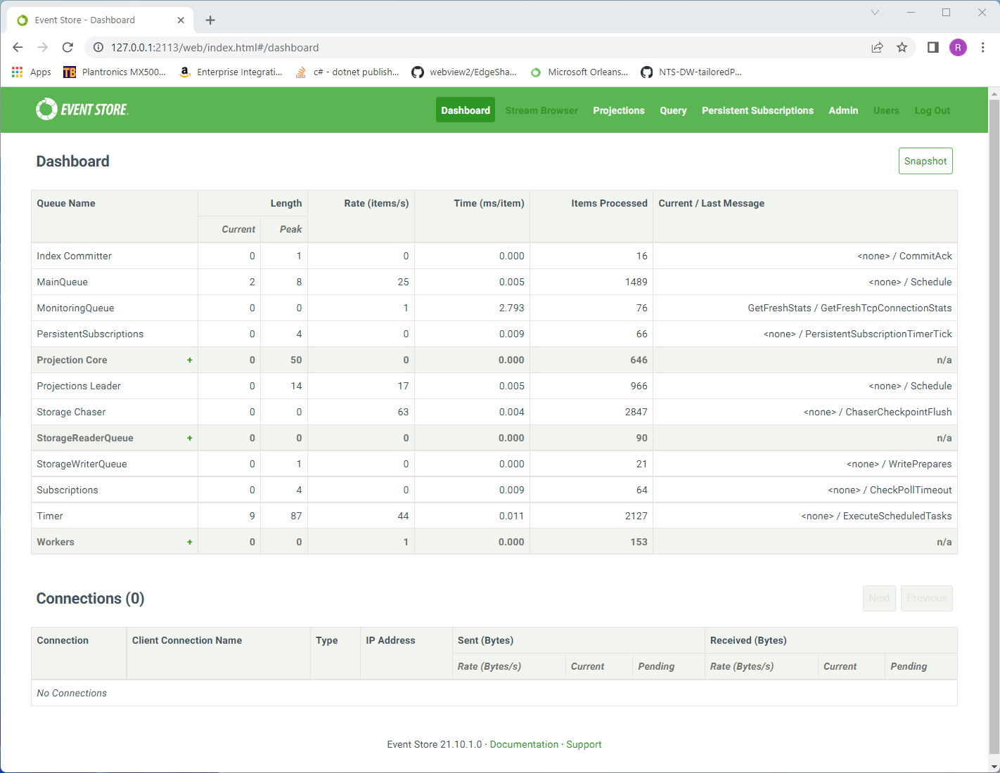

# Introduction #

Welcome to EventStore DB.

This outlines the very basics you need in order to start from nothing to bring an instance of EventStore DB online and using it to move messages through the database.  This QuickStart is geared toward software developers that have knowledge of dotnet core, but have never used EventStore DB before.

## Prerequisites ##

* [dotnet core v6 SDK](https://dotnet.microsoft.com/en-us/download/dotnet/6.0)
* [Visual Studio Code](https://code.visualstudio.com/download)

For these purposes, we are using dotnet 6 sdk v6.0.202 and Visual Studio Code: Version: 1.66.2 (system setup) @ commit: dfd34e8260c270da74b5c2d86d61aee4b6d56977

EventStore DB will be running from `C:\ESDB`

## Download ##

EventStore DB can be downloaded from [https://www.eventstore.com/downloads](https://www.eventstore.com/downloads).  You will want to choose the latest version.  For this discussion, we will be using v21.10.2 LTS and will be working on a Windows 11 PC.

Once downloaded, go to your `Downloads` folder (or where-ever your downloads are saved) and look for the *.zip file you have just downloaded.  Right-click and choose `Extract All` from the context menu, choosing `C:\ESDB\`.

## Launch EventStore DB For the First Time ##

With EventStore DB now available on your workstation, open a PowerShell prompt and change your directory:

```PowerShell
cd c:\ESDB
```

Once in the directory, execute the following command to bring a single node instance of EventStore DB online:

```PowerShell
.\EventStore.ClusterNode.exe --insecure=true --RunProjections=All --memdb=true --start-standard-projections=true --enableatompuboverhttp=true
```

To ensure this is now online, open a web browser and navigate to [http://localhost:2113/](http://localhost:2113/)  If this is successful, you should see a web page that looks similar to this:



This will provide you an instance of EventStore DB that runs completely in-memory and has no security measures in-place.  **DO NOT** use this for a production setup.

## Example Project ##

To start connecting and otherwise interacting with EventStore DB, we're going to create a small solution of several dotnet console applications.  The final result of this document is provided here as well.

### Project Structure ###

#### StreamWriter ####

The stream-writer will be a tool with a basic command prompt that will write one or more pre-defined events into EventStore DB.

#### StreamReader ####

The stream-reader will be a tool with a basic command prompt that will read the newly written events from EventStore DB.

#### AllStreamListener ####

This application will listen to the $all stream, which is the global log of all events ever written into EventStore DB.  You can learn more about the $all stream [here](http://tbd/)

#### StreamListener ####

This application will perform the same basic task as the AllStreamListener application, but will be listening for a specific stream of events, rather than every single event ever committed into EventStore DB.

To quickly get the project structure setup, use the script below:
```PowerShell
mkdir StreamWriter; `
mkdir StreamReader; `
mkdir AllStreamListener; `
mkdir StreamListener; `
dotnet new sln; `
dotnet new console -o ./StreamWriter; `
dotnet new console -o ./StreamReader; `
dotnet new console -o ./AllStreamListener; `
dotnet new console -o ./StreamListener; `
dotnet sln add ./StreamWriter; `
dotnet sln add ./StreamReader; `
dotnet sln add ./AllStreamListener; `
dotnet sln add ./StreamListener

```

Now that you have a basic solution together, we need to add two additional packages:

* EventStore DB Grpc Client
* System.Text.Json

```PowerShell
dotnet add ./StreamWriter/StreamWriter.csproj package EventStore.Client.Grpc.Streams --version 22.0.0; `
dotnet add ./StreamWriter/StreamWriter.csproj package System.Text.Json --version 6.0.3; `
dotnet add ./StreamReader/StreamReader.csproj package EventStore.Client.Grpc.Streams --version 22.0.0; `
dotnet add ./StreamReader/StreamReader.csproj package System.Text.Json --version 6.0.3; `
dotnet add ./AllStreamListener/AllStreamListener.csproj package EventStore.Client.Grpc.Streams --version 22.0.0; `
dotnet add ./AllStreamListener/AllStreamListener.csproj package System.Text.Json --version 6.0.3; `
dotnet add ./StreamListener/StreamListener.csproj package EventStore.Client.Grpc.Streams --version 22.0.0; `
dotnet add ./StreamListener/StreamListener.csproj package System.Text.Json --version 6.0.3

```

The main Grpc Client library allows you to read & write streams from EventStore DB.  System.Text.Json provides the ability to serialize in-memory CLR objects to Json for storage in EventStore DB.

>_Note 1_: Although we are using System.Text.Json to serialize our CLR objects, you can use any Json serialization library (Newtonsoft, SimpleJson, etc.)

>_Note 2_: EventStore DB natively stores the metadata and body of each event as a series of bytes, not text.  If your requirements state that you must use another messaging format like protobuf, bson, etc.; storage is possible, but you will not have an ability to use some of the advanced features of EventStore DB.

### Writing Your First Event ###

With the solution framework setup, let's write out first event.

Open the `Program.cs` file in your `StreamWriter` project.  Replace the contents with the following code snippet:

```CSharp
using System.Text.Json;

using EventStore.Client;

// data elements of two events to be stored within EventStore DB
var events = new[]{
    new {
        Type = "NewUser",
        Metadata = new{
            Date = DateTime.Now
        },
        Body = new {
            Id = Guid.NewGuid(),
            FirstName = "George",
            LastName = "Washington"
        }
    },
    new {
        Type = "NewUser",
        Metadata = new{
            Date = DateTime.Now
        },
        Body = new {
            Id = Guid.NewGuid(),
            FirstName = "Samuel",
            LastName = "Adams"
        }
    }
};

// basic connection to EventStore DB
var settings = EventStoreClientSettings.Create("esdb://localhost:2113?tls=false");
settings.DefaultCredentials = new UserCredentials("admin", "changeit");
var client = new EventStoreClient(settings);
Console.WriteLine("EventStore DB Connection setup.");

// Serialization of the above data.
var serialized = events.Select(e => new EventData(Uuid.NewUuid(), e.Type, JsonSerializer.SerializeToUtf8Bytes(e.Body), JsonSerializer.SerializeToUtf8Bytes(e.Metadata))).ToArray();
Console.WriteLine("Events are serialized and ready for storage.");

// storing the serialized events within EventStore DB
await client.AppendToStreamAsync(
    streamName: "users", 
    expectedRevision: StreamRevision.None, 
    eventData: serialized);
Console.WriteLine("Events have been stored.");
```

Go ahead and save `Program.cs`, then, from the command line, execute the following:

```PowerShell
dotnet run --project .\StreamWriter\StreamWriter.csproj
```

This executes the application and writes your first two events to EventStore DB.  You can validate this by opening your web browser and navigate to [http://localhost:2113/](http://localhost:2113/).  This site is the console UI of EventStore DB.  On the top navigation, go ahead and click the `Stream Browser` link.  You should see a screen similar to:


The left-hand column of the screen shows the list of recently created streams.  If you compare the entry of `users` with the `streamName` value on line 43, you will see that they are the same.  Go ahead and click on the `users` stream link.


In this screen, you will be able to review each of the two events that you have created within the `StreamWriter` console application.  Now, let's talk through the basic information of this screen:

* The Event # column identifies within a stream which event is being addressed.  This is typically a sequential value.  When you do subsequent reads (later in this document), you can provide this number as a starting event to read from.
* The Name of the event, typically noted as `[EventNumber]@[EventStreamName]` is [TBD].
* The `Type` is the type of event.  In the simple code we used to create these event entries, you'll note the type to be the same.  This is useful for better understanding of what the data means at a business level, and how best to decode and interpret the data in relation to your business rules.

Click on the `1@users` link.  You should see a new screen similar to the following:


This is now the details of the second event you wrote in the console application.  Note both the `Metadata` and `Data` values are equivalent to the Metadata and Data values in code.

### Reading Your Event ###

Cool!  You've written your first two events into EventStore DB.  Quite easy, is it not?  Now, for EventStore DB to be completely useful, you need to have access to this data in the future.  In RDBMS solutions, we `SELECT` this data into a series of records, then map it into our CLR objects.  With EventStore DB, you read the created stream, then de-serialize the information using a JsonSerializer, into your CLR objects for use.

Open the `Program.cs` file in the `StreamReader` project.  Paste the following code into the file, replacing everything else:

```CSharp
// basic connection to EventStore DB
using System.Text;

using EventStore.Client;

var settings = EventStoreClientSettings.Create("esdb://localhost:2113?tls=false");
settings.DefaultCredentials = new UserCredentials("admin", "changeit");
var client = new EventStoreClient(settings);
Console.WriteLine("EventStore DB Connection setup.");

var reader = client.ReadStreamAsync(
    direction: Direction.Forwards,
    streamName: "users",
    StreamPosition.Start
);

await foreach(var e in reader) {
    var metadata = Encoding.UTF8.GetString(e.Event.Metadata.ToArray());
    var data = Encoding.UTF8.GetString(e.Event.Data.ToArray());

    Console.WriteLine($"Event Position: {e.OriginalEventNumber}");
    Console.WriteLine($"Event Metadata: {metadata}");
    Console.WriteLine($"Event Data: {data}\n");
}

Console.WriteLine("Read completed.");
```

Save the file, then execute it with the following command:

```PowerShell
dotnet run --project .\StreamReader\StreamReader.csproj
```

With the application completed, you should have output similar to:

```
PS C:\> dotnet run --project .\StreamReader\StreamReader.csproj
EventStore DB Connection setup.
Event Position: 0
Event Metadata: {"Date":"2022-04-28T13:14:53.8737529-04:00"}
Event Data: {"Id":"bd6656fa-525a-475c-b400-a1e4c6e06478","FirstName":"George","LastName":"Washington"}

Event Position: 1
Event Metadata: {"Date":"2022-04-28T13:14:53.8800612-04:00"}
Event Data: {"Id":"1e92905b-f019-4791-98a8-9561ee88a03f","FirstName":"Samuel","LastName":"Adams"}

Read completed.
```

If you compare this output with the EventStore DB Console screen for each event, you will see the values are the same.


### Subscribing to Streams ###

Let's take a moment before we continue to talk about the best way to use a streaming database.  

In traditional RDBMS programming, everything that you do is `INSERT`, `UPDATE`, `SELECT`, and `DELETE` operations.  

With stream databases, all new data is appended within the database, much like you would write a new entry into your general ledger or checkbook.  Also, you're not needing to perform `SELECT` or `READ` operations in most circumstances, but rather `Subscribe` to a stream and listen for changes as they occur.  If you've ever worked with UI tools like ReactUI, Caliburn.Micro, or Knockout.JS, then you have a cursory understanding of how this will work.

Why is this important?  In traditional RDBMS based solutions, if you want to see updates as users interact with your product, you have to poll the database using `SELECT` over, and over, again.  This creates significantly more load on your RDBMS, especially as the adoption of your application grows.

Hmm... ok... so, let's relieve that issue.  We'll just have a caching layer in our application.  When someone adds new information, changes information, or removes information from the system, we will invalidate the cached results, and only re-build them the next time someone asks for the updated information.  Our answer looks like:

* Select a caching solution (Redis, Couchbase, etc.)
* Write a wrapper between our data storage and retrieval logic to check our data cache first.  If we have something in cache, return the cache'd data instead of our read from the database.
* Adjust our insert, update, and delete events to invalidate the cache.
* Re-test all scenarios to ensure the cache is updated for each operation within the system.
* Deploy our caching solution into our environment.
* Publish our application.
* Hope for the best.

As our solution continues to gain adoption and has to scale, we then have to:

* Add more nodes to our RDBMS cluster to handle the database load
* Add more caching nodes to our cache cluster to handle additional caching operations.
* Run regression testing to ensure our caching solution will not break under our new minimum load.

What just happened?  We've introduced additional software into our infrastructure, added additional code into our application, and taken on additional third-party libraries to interact with the caching solution.  Also too, we have to do a complete regression of our application to ensure we have not broken anything as part of our enhancements to allow scaling.  This can be quite costly, and make future updates more cumbersome as we have more code to maintain.

With stream-based databases, this is not the case.  Think about it, you only ever need to change what is displayed on-screen when you introduce new information into EventStore DB.  You are never asking if changes have happened, instead listening for those changes and _reacting_ to them.  When a new event is observed, we can update in-memory read models, then serve those read models any time a user refreshes their browser... or, in the case of a desktop application, automatically update the user interface without a button to re-load the data, and without constant polling of the database.

Let's complete the final project(s) in this tutorial to tie everything together.

#### Stream Writer ####

We're going to adjust the stream writer application to continuously create events into three different streams, with a 250ms delay.  This will emulate users interacting with our solution.

```CSharp
using System.Text.Json;

using EventStore.Client;

// data elements of two events to be stored within EventStore DB
var events = new[]{
    new {
        Type = "NewUser",
        Metadata = new{
            Date = DateTime.Now
        },
        Body = new {
            Id = Guid.NewGuid(),
            FirstName = "Samuel",
            LastName = "Adams"
        }
    }
};

// basic connection to EventStore DB
var settings = EventStoreClientSettings.Create("esdb://localhost:2113?tls=false");
settings.DefaultCredentials = new UserCredentials("admin", "changeit");
var client = new EventStoreClient(settings);
Console.WriteLine("EventStore DB Connection setup.");

// Serialization of the above data.
var serialized = events.Select(e => new EventData(Uuid.NewUuid(), e.Type, JsonSerializer.SerializeToUtf8Bytes(e.Body), JsonSerializer.SerializeToUtf8Bytes(e.Metadata))).ToArray();
Console.WriteLine("Events are serialized and ready for storage.");

int index = 0;

do {
    // adds a NewUser event to the users stream
    var user = new {
        Type = "NewUser",
        Metadata = new{
            Date = DateTime.Now
        },
        Body = new {
            Id = Guid.NewGuid(),
            FirstName = $"First Name #{index}",
            LastName = $"Washington {index}"
        }
    };

    var userEventData = new EventData(Uuid.NewUuid(), user.Type, JsonSerializer.SerializeToUtf8Bytes(user.Body), JsonSerializer.SerializeToUtf8Bytes(user.Metadata));

    await client.AppendToStreamAsync(
        streamName: "users",
        expectedState: StreamState.Any,
        eventData: new[] { userEventData });
    Console.WriteLine("New User added.");


    // adds a ClockedIn event into the timeclock stream.
    var timeClock = new {
        Type = "ClockedIn",
        Metadata = new {
            Date = DateTime.Now
        },
        Body = new {
            Id = Guid.NewGuid(),
            UserId = user.Body.Id,
            TimeIn = DateTime.Now
        }
    };

    var timeClockEventData = new EventData(Uuid.NewUuid(), timeClock.Type, JsonSerializer.SerializeToUtf8Bytes(timeClock.Body), JsonSerializer.SerializeToUtf8Bytes(timeClock.Metadata));

    await client.AppendToStreamAsync(
        streamName: "timeclock",
        expectedState: StreamState.Any,
        new[] { timeClockEventData }
    );
    Console.WriteLine("User just clocked-in.");

    await Task.Delay(250);
} while(true);
```


#### Stream Listener ####

In our stream listener program, we are going to listen for any new information when something happens in reference to the `users` stream.

```CSharp
// basic connection to EventStore DB
using System.Text;

using EventStore.Client;

var settings = EventStoreClientSettings.Create("esdb://localhost:2113?tls=false");
settings.DefaultCredentials = new UserCredentials("admin", "changeit");
var client = new EventStoreClient(settings);
Console.WriteLine("EventStore DB Connection setup.");

var listener = client.SubscribeToStreamAsync(
    streamName: "users",
    start: FromStream.Start,
    eventAppeared: (subscription, e, token) => {
        var metadata = Encoding.UTF8.GetString(e.Event.Metadata.ToArray());
        var data = Encoding.UTF8.GetString(e.Event.Data.ToArray());

        Console.WriteLine($"Event Position: {e.OriginalEventNumber}");
        Console.WriteLine($"Event Metadata: {metadata}");
        Console.WriteLine($"Event Data: {data}\n");
        
        return Task.CompletedTask;
    }
);

using(var subscription = await listener) {
    Console.ReadLine();
}
```

#### All Stream Listener ####

In our all stream listener program, we are going to listen for any new information that is appended into the database without regard for what it is in reference to.

```CSharp
// basic connection to EventStore DB
using System.Text;

using EventStore.Client;

var settings = EventStoreClientSettings.Create("esdb://localhost:2113?tls=false");
settings.DefaultCredentials = new UserCredentials("admin", "changeit");
var client = new EventStoreClient(settings);
Console.WriteLine("EventStore DB Connection setup.");

var listener = client.SubscribeToAllAsync(
    start: FromAll.Start,
    eventAppeared: (subscription, e, token) => {
        var metadata = Encoding.UTF8.GetString(e.Event.Metadata.ToArray());
        var data = Encoding.UTF8.GetString(e.Event.Data.ToArray());

        Console.WriteLine($"Event Position: {e.OriginalEventNumber}");
        Console.WriteLine($"Event Metadata: {metadata}");
        Console.WriteLine($"Event Data: {data}\n");

        return Task.CompletedTask;
    }
);

using(var subscription = await listener) {
    Console.ReadLine();
}
```

With all three console applications updated, we can now execute them.  Open up three PowerShell console windows, and execute the following commands, one in each console window.

**Stream Listener (Listens for changes in the 'users' stream)**
```PowerShell
dotnet run --project .\StreamListener\StreamListener.csproj
```

**All Stream (listens for changes anywhere within the general ledger)**
```PowerShell
dotnet run --project .\AllStreamListener\AllStreamListener.csproj
```

**Stream Writer**
```PowerShell
dotnet run --project .\StreamWriter\StreamWriter.csproj
```

You'll notice that each time a new user is created & they punch in, you will get an update to the StreamListener application that the user was added.  In the AllStream application, you'll see that not only new users have been created, but that each user has also clocked in.

# Where to go From Here #

[How to finish?]

_notes_: I feel like there needs to be a few call to action items from this point:

* Review the rest of EventStore DB's [documentation](https://developers.eventstore.com/server/v21.10/#getting-started)
* Review the documentation for the [gRPC client](https://developers.eventstore.com/clients/grpc/#connection-details) _note_: we need to somehow express here that there are clients available for other languages.
* Learn more about ES/CQRS from "the professionals"
* Look at one or more ES toolkits that are available:
  * [Reactive-Domain](https://github.com/ReactiveDomain/reactive-domain)
  * [Eventuous](https://eventuous.dev/)
  * others?
